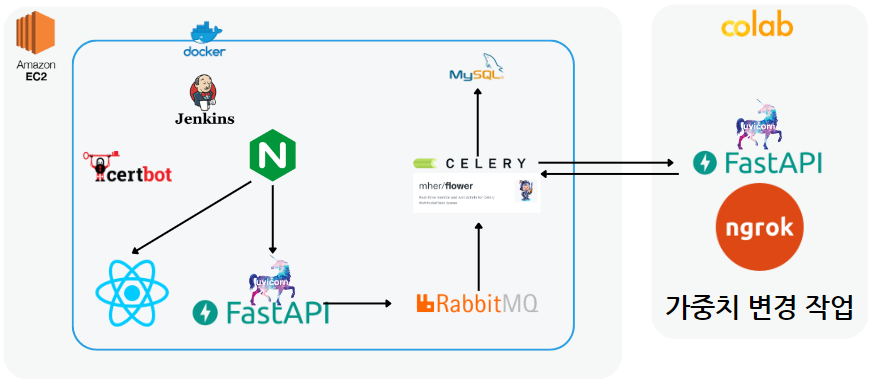

# 🌐 아임파인

{: width="300" height="300"}

## 📌 목차

1. [개요](#1-개요)
2. [프로젝트 소개](#2-프로젝트-소개)
3. [주요 기능](#3-주요-기능)
4. [시작하기](#시작하기)
5. [기술스택](#5-기술-스택)
6. [프로젝트 구조도](#6-프로젝트-구조도)
7. [시스템 아키텍쳐](#7-시스템-아키텍쳐)
8. [TEAM](#8-team)

<br>
<br>

## 1. 개요

- 개발 기간: 2023.10.10 ~ 2023.11.17

- 삼성 청년 소프트웨어 아카데미(SSAFY) 자율 프로젝트
  
  `#AI` `#fine-tuning`

<br>
<br>

## 2. 프로젝트 소개

🌊 아임파인 : I'm fine-tuning service의 약자

- pre-trained model을 파인튜닝하여 모델을 생성하고, 생성된 모델의 입출력을 보여주는 서비스

<br>

> pre-trained model이란?

- 내가 풀고자 하는 문제와 비슷하면서 사이즈가 큰 데이터로 이미 학습이 되어 있는 모델

> 파인튜닝이란?

- pre-trained model의 가중치를 조정하여 특정 작업이나 도메인에 대한 성능을 개선하는 방법

<br>
<br>

## 3. 주요 기능

### 3.1. pre-trained 모델 선택

{: width="400" height="300"}

- LLAMA2, GPT2, Stable Diffusion 모델 중 하나를 선택
- LLAMA2, GPT2 모델은 텍스트 모델 (텍스트 입력, 텍스트 출력)
- Stable Diffusion 모델은 이미지 모델 (텍스트 입력, 이미지 출력)

<br>

### 3.2. 사용자 입력

{: width="500" height="300"}

- 사용자가 텍스트 입력 후 파라미터 값 직접 조정

<br>

### 3.3. 로딩 화면

{: width="300" height="300"}

- 조정한 파라미터 값으로 파인튜닝 및 입력에 해당하는 답변 출력 중

<br>

### 3.4 출력 화면

{: width="400" height="300"}

- 입력에 해당하는 답변 출력

<br>
<br>

## 🚩 시작하기

### 4.1. server 실행

1. **원격 저장소 복제(git clone)**

```bash
$ https://lab.ssafy.com/s09-final/S09P31D109.git
```

2. **프로젝트 폴더로 이동**

```bash
$ cd finetune-back\src
```

3. **패키지 설치**

```bash
$ pip install -r requirements.txt
```

4. **main 메서드 실행하기**

```bash
$ uvicorn main:app --reload
```

<br>

### 4.2. web 실행

1. **프로젝트 폴더로 이동**

```bash
$ cd finetune-web
```

2. **npm 설치**

```bash
$ npm i
```

3. **npm 실행**

```bash
$ npm start
```

<br>
<br>

## 5. 기술 스택

### 5.1. Back-End

- **FastAPI**  : 아임파인 Project의 전반적인 Rest Controller 구현
- **SSL 프로토콜** : SSL을 적용하여 전ㄴ송되는 패킷값을 암호화하여 외부의 공격자로부터 데이터를 보안하기 위해 사용.
  - Let's Encypt 무료 인증서를 발급받아 웹서버에 SSL 인증서를 적용.
- **AWS** : EC2 서비스를 이용하여 Ubuntu 서버를 구축 (호스팅).
- **Nginx** : 웹 서버를 구축
- **Google Colab** : 파인튜닝을 하기 위한 GPU 서버.

<br>

### 5.2. Front-End

- **React** : 아임파인 Project의 Web 구현

<br>

### 5.3. TEAM Cooperaion

- **GitLab**: GitLab을 활용하여 프로젝트를 관리.
  - Git Flow 에 따른 브랜치 전략 수립.
  - MR 시 코드 리뷰 진행.
- **Jira**: 이슈 관리 도구로 활용.
  - 주요 기능들을 이슈로 등록하고 Stroy Point를 산정한 후, 담당자를 지정하여 프로젝트를 진행.
  - 1~2 주 정도 상황에 맞게 스프린트를 설정.
- **Google Drive** : 협업을 위한 공용 문서 및 산출물들을 공유할 수 있도록 활용.
  - 동시 문서 작성 (Google Docs).
  - 대용량 파일 첨부.
- **Notion** 
  - 일정 관리 및 트러블 슈팅 메모.
  - 세션을 통해 새로운 지식 공유.

<br>
<br>

## 6. 프로젝트 구조도

```
└─📂backend
    └─📁 src
└─📂frontend
    └─📁 node_modules
    └─📁 public
    └─📁 src
```

<br>
<br>

## 7. 시스템 아키텍쳐

{: width="500" height="300"}

<br>
<br>

## 👤 TEAM 

- 김현진 - Hyunjin Kim - [Back]
- 김형진 - Hyungjin Kim - [Back]
- 박현우 - Hyunwoo Park - [Front]
- 손민균 - Minkyun Son - [Back]
- 이상혁 - Sanghyuk Lee - [Back]
- 이현근 - Yongwoo Jeong - [Back]
